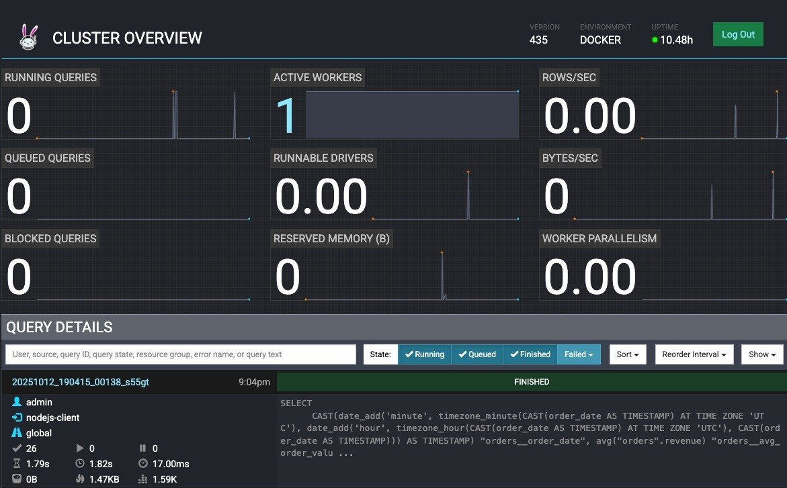
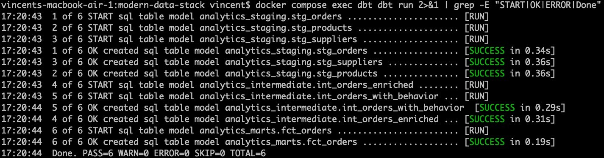
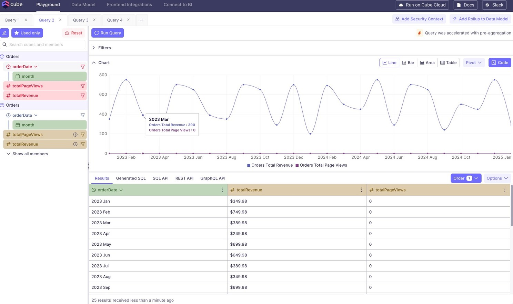
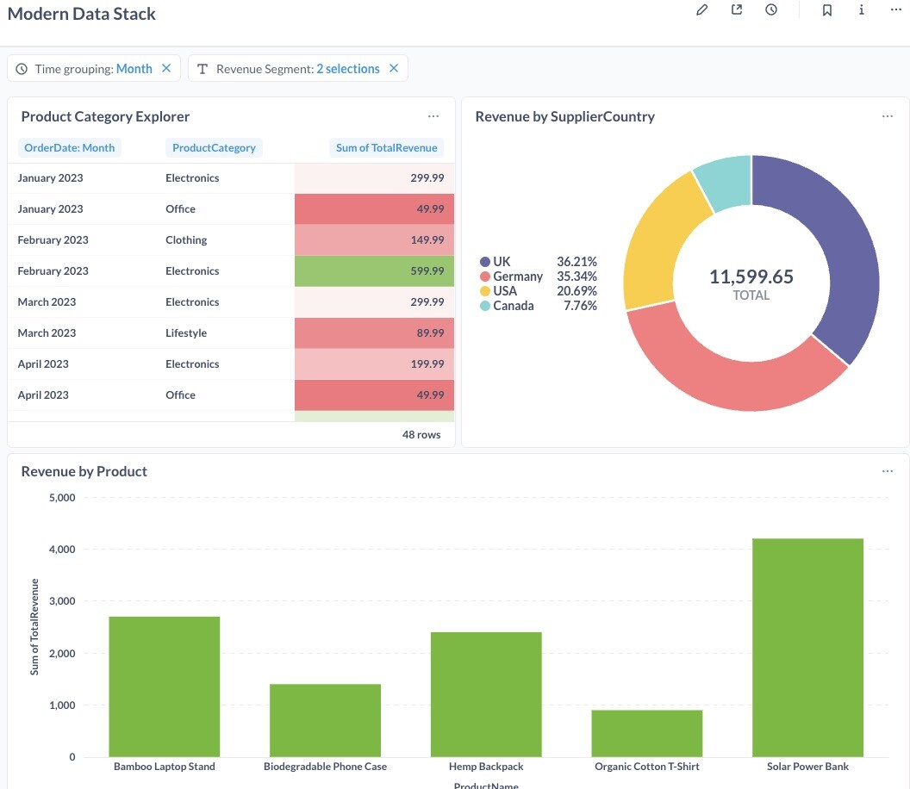
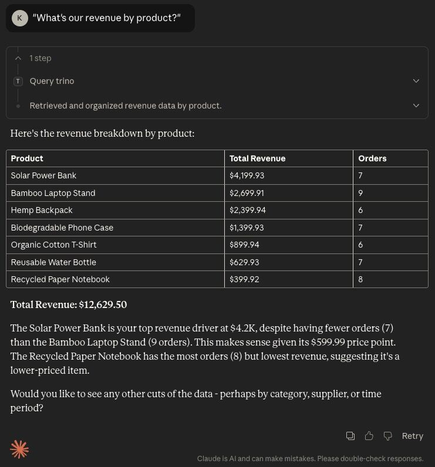

# Modern Data Stack - Vendor-Agnostic Open Source Architecture

[](https://opensource.org/licenses/MIT)
[](https://www.docker.com/)
[](https://polaris.apache.org/)
[](https://trino.io/)
[](https://modelcontextprotocol.io/)
[](https://mistral.ai/)

> A complete, production-ready modern data stack built entirely with open-source components. Demonstrates cross-database federation, lakehouse architecture with Apache Iceberg, dbt transformations, semantic layer, and self-service BI—all vendor-agnostic and Git-based. **Plus: Dual AI interfaces - Claude MCP for natural language exploration and Streamlit app for multi-provider comparison (Claude vs Mistral vs Ollama).**

## 🎯 What This Stack Delivers

**v2.1:** Added **dbt MetricFlow** with OSI-compatible semantic models—testing the promise of "define once, use everywhere" across semantic layer tools.

**v2.0:** Migrated from Hive Metastore to **Apache Polaris** (Iceberg REST catalog) for modern lakehouse capabilities with improved authentication and setup automation. **Plus: Dual AI interfaces - Claude MCP integration for Claude Desktop and Streamlit comparison app (Claude API vs Mistral AI vs Ollama local).**

This implementation proves that enterprise-grade data architecture is achievable without vendor lock-in:
- ✅ **Cross-database federation** via Trino - query PostgreSQL, MySQL, and object storage simultaneously
- ✅ **Modern lakehouse** with Apache Polaris and Iceberg - ACID transactions, time travel, schema evolution
- ✅ **Git-based transformations** with dbt - version-controlled SQL models
- ✅ **Semantic layer** with Cube.js - centralized metrics and governance
- ✅ **OSI-ready** semantic models with dbt MetricFlow - testing Open Semantic Interchange specification for vendor interoperability
- ✅ **Self-service analytics** with Metabase - drag-and-drop visualization
- ✅ **AI-powered interfaces** - Claude MCP for exploration + Streamlit for multi-provider comparison (Claude/Mistral/Ollama)
- ✅ **Full data sovereignty** - complete control over data location and processing
- ✅ **Hybrid-ready** - mix self-hosted with managed services as needed

**Processing synthetic e-commerce data:** Orders from PostgreSQL → Product catalogs from MySQL → User events from object storage → Unified analytics layer → AI-powered natural language interface.







## 🏗️ Architecture

```
                    Modern Data Stack v2 Architecture
                    
┌───────────────────────────────────────────────────────────────┐
│                        DATA SOURCES                           │
├───────────────────────────────────────────────────────────────┤
│  PostgreSQL        MySQL           MinIO (S3-compatible)      │
│  (Orders)          (Products)      (User Events - Parquet)    │
└──────┬─────────────┬───────────────┬──────────────────────────┘
       │             │               │
       └─────────────┴───────────────┘
                     │
       ┌─────────────▼───────────────┐       ┌──────────────────────────┐
       │   FEDERATION LAYER          │◄──────│  AI INTERFACES           │
       │   Trino (35+ connectors)    │       │  • Claude MCP            │
       │   Real-time cross-DB joins  │       │  • Streamlit (3-way)     │
       └─────────────┬───────────────┘       │    Claude/Mistral/Ollama │
                     │                       └──────────────────────────┘
       ┌─────────────▼───────────────┐
       │   LAKEHOUSE CATALOG         │
       │   Apache Polaris            │
       │   (Iceberg REST Catalog)    │
       │   - OAuth authentication    │
       │   - ACID transactions       │
       │   - Schema evolution        │
       └─────────────┬───────────────┘
                     │
       ┌─────────────▼───────────────┐
       │   TRANSFORMATION LAYER      │
       │   dbt Core                  │
       │   - Staging → Intermediate  │
       │   - → Marts (star schema)   │
       │   - Writes Iceberg tables   │
       └─────────────┬───────────────┘
                     │
       ┌─────────────▼───────────────┐
       │   SEMANTIC LAYER            │
       │   Cube.js                   │
       │   - Metrics definitions     │
       │   - Access control          │
       │   - Pre-aggregations        │
       └─────────────┬───────────────┘
                     │
       ┌─────────────▼───────────────┐
       │   VISUALIZATION             │
       │   Metabase                  │
       │   - Self-service BI         │
       │   - Interactive dashboards  │
       └─────────────────────────────┘
```

## 🚀 Quick Start

### Prerequisites
- Docker Desktop (with Docker Compose)
- 8GB RAM minimum (16GB recommended)
- 10GB free disk space
- **Optional:** Claude Desktop for AI interface

### Installation

```bash
# Clone repository
git clone https://github.com/vincevv017/modern-data-stack.git
cd modern-data-stack

# Start all services (takes 2-3 minutes)
docker compose up -d

# Wait for services to initialize
sleep 30

# Setup Apache Polaris catalog (auto-detects credentials)
bash init-scripts/polaris/setup-polaris.sh

# Create lakehouse schemas
bash init-scripts/polaris/setup-lakehouse-schemas.sh
```

### Load Sample Data

After schemas are created, load user events data into the lakehouse:

```bash
# Upload Parquet file to MinIO
docker compose cp lakehouse-data/user_event/data-001.parquet mc:/tmp/
docker compose exec mc mc cp /tmp/data-001.parquet myminio/raw-data/user_event/

# Verify upload
docker compose exec mc mc ls myminio/raw-data/user_event/
# Should show: data-001.parquet

# Create external table in lakehouse
docker compose exec trino trino << 'EOSQL'
CREATE SCHEMA IF NOT EXISTS lakehouse.raw_data 
WITH (location = 's3://raw-data/');

CREATE TABLE IF NOT EXISTS lakehouse.raw_data.user_events (
    user_id INTEGER,
    event_type VARCHAR,
    session_id VARCHAR,
    event_timestamp TIMESTAMP(6),
    page_url VARCHAR
)
WITH (
    format = 'PARQUET',
    external_location = 's3://raw-data/user_event/'
);

SELECT COUNT(*) FROM lakehouse.raw_data.user_events;
EOSQL

# ⚠️ CRITICAL: Run dbt transformations to create dbt_marts tables
# Without this, Cube.js and the AI interfaces won't work!
docker compose exec dbt dbt run

# Verify complete setup
docker compose exec trino trino --execute "SHOW CATALOGS;"
docker compose exec trino trino --execute "SHOW SCHEMAS IN lakehouse;"
docker compose exec trino trino --execute "SHOW TABLES IN lakehouse.dbt_marts;"
```
### Setup MetricFlow

```bash
# Build time spine (calendar table)
docker compose exec dbt dbt run --select metricflow_time_spine

# Run validation script
docker compose exec dbt bash dbt/scripts/validate-metricflow.sh
```

### 🤖 Optional: Setup AI Interface (Claude MCP)

Experience natural language queries to your lakehouse:

```bash
# Install Claude Desktop
# Download from: https://claude.ai/download

# Install Python dependencies
/opt/homebrew/bin/python3 -m pip install mcp trino requests

# Configure Claude Desktop
cat > ~/Library/Application\ Support/Claude/claude_desktop_config.json << EOF
{
  "mcpServers": {
    "trino": {
      "command": "python3",
      "args": [
        "$(pwd)/mcp-servers/trino/server.py"
      ]
    }
  }
}
EOF

# Restart Claude Desktop
# Now you can query your lakehouse in natural language!
```

**Try it:**
- "What schemas exist in the lakehouse?"
- "Show me tables in dbt_marts"
- "What's the total revenue from fct_orders?"

### Access Points

| Service | URL | Credentials |
|---------|-----|-------------|
| **Trino UI** | http://localhost:8080 | None (auto-login as admin) |
| **Cube.js Playground** | http://localhost:4000 | None |
| **Metabase** | http://localhost:3000 | Setup on first visit |
| **MinIO Console** | http://localhost:9001 | admin / password123 |
| **Polaris API** | http://localhost:8181 | OAuth (auto-configured) |
| **MetricFlow API** | http://localhost:8001 | future use |
| **Claude MCP** | Claude Desktop App | Natural language interface |

## 📊 Demo Query

Experience the full stack with this federation query:

```bash
docker compose exec trino trino --execute "
SELECT 
    product_name,
    supplier_country,
    COUNT(*) as order_count,
    SUM(revenue) as total_revenue,
    AVG(revenue) as avg_revenue
FROM lakehouse.dbt_marts.fct_orders
GROUP BY product_name, supplier_country
ORDER BY total_revenue DESC
LIMIT 10;"
```

**Or ask Claude:**
```
"Show me the top 10 products by revenue, grouped by supplier country"
```

This query:
1. Reads from dbt-transformed Iceberg tables in the lakehouse
2. Aggregates data with ACID guarantees
3. Returns business metrics ready for visualization

## 🔧 What's New in v2.0

### Major Changes

#### 1. **Apache Polaris Integration** (replaces Hive Metastore)
- Modern Iceberg REST catalog with OAuth authentication
- Auto-credential detection from Polaris logs
- Comprehensive setup scripts with error handling
- Proper role-based access control (RBAC)

#### 2. **dbt Writes to Lakehouse**
- dbt now writes Iceberg tables directly to lakehouse
- Separation of storage (MinIO/S3) and compute (Trino)
- ACID transactions for analytics tables
- Time travel and schema evolution support

#### 3. **Improved Setup Automation**
- `setup-polaris.sh` - Main setup with auto-detection
- `setup-lakehouse-schemas.sh` - Schema initialization
- `recreate-catalog.sh` - Quick catalog recreation
- `check-what-broke.sh` - Diagnostic troubleshooting

#### 4. **Critical Configuration Discovery**
- `fs.native-s3.enabled=true` enables Trino native S3
- Required for Polaris REST catalog with MinIO
- Fixes "No factory for location" errors

#### 5. **🆕 AI-Powered Interface (Claude MCP)**
- Natural language queries to lakehouse
- Conversational schema exploration
- No SQL knowledge required
- Demonstrates modern AI + data integration

### Breaking Changes from v1
- Hive Metastore container removed
- `lakehouse.properties` now uses `iceberg.rest-catalog.*` properties
- New initialization workflow required
- OAuth credentials must be configured

## 📁 Project Structure

```
modern-data-stack/
├── docker-compose.yml              # Infrastructure as code
├── init-scripts/
│   ├── polaris/                    # Polaris setup scripts
│   │   ├── setup-polaris.sh        # Main setup (use this)
│   │   ├── setup-lakehouse-schemas.sh
│   │   ├── recreate-catalog.sh     # Quick rebuild
│   │   └── check-what-broke.sh     # Diagnostics
│   ├── postgres/                   # PostgreSQL init
│   └── mysql/                      # MySQL init
├── lakehouse-data/
│   └── user_event/
│       └── data-001.parquet        # Sample user events
├── trino/
│   ├── catalog/                    # Data source configs
│   │   ├── lakehouse.properties    # Polaris catalog
│   │   ├── postgres.properties     # Orders DB
│   │   └── mysql.properties        # Products DB
│   └── config/
│       └── config.properties       # Trino settings
├── dbt/
│   ├── dbt_project.yml
│   ├── profiles.yml                # Trino connection
│   └── models/
│       ├── staging/                # Raw data models
│       ├── intermediate/           # Business logic
│       └── marts/                  # Analytics-ready facts
│       └── semantic_models/  # v2.1: MetricFlow OSI definitions
│           ├── orders.yml                    # Semantic model & metrics
│           ├── metricflow_time_spine.sql     # Calendar table
│           └── metricflow_time_spine.yml     # Time spine metadata
│   └── scripts/
│       └── validate-metricflow.sh  # v2.1: MetricFlow validation
├── cube/
│   └── model/
│       └── Orders.js               # Semantic layer definitions
├── mcp-servers/                    # 🆕 AI Interface (Claude MCP)
│   └── trino/
│       └── server.py               # Claude MCP server
├── streamlit-app/                  # 🆕 AI Interface (Multi-Provider)
│   ├── app.py                      # Streamlit application
│   ├── requirements.txt            # Python dependencies
│   ├── .env.example                # API key template
│   └── README.md                   # Detailed documentation
├── POLARIS_TRINO_CONFIG.md         # Configuration notes
└── README.md
```

## 🛠️ Common Operations

### Managing Services

```bash
# View service status
docker compose ps

# View logs
docker compose logs -f polaris
docker compose logs -f trino

# Restart a service
docker compose restart trino

# Stop all services
docker compose down

# Stop and remove volumes (fresh start)
docker compose down -v
```

### Polaris Catalog Management

```bash
# Check if catalog exists
bash init-scripts/polaris/check-what-broke.sh

# Recreate catalog (if needed)
bash init-scripts/polaris/recreate-catalog.sh

# View Polaris credentials
docker compose logs polaris | grep "root principal credentials"

# Update Trino with new credentials (if needed)
CREDS=$(docker compose logs polaris | grep "root principal credentials" | tail -1 | sed 's/.*credentials: //')
sed -i.bak "s/iceberg.rest-catalog.oauth2.credential=.*/iceberg.rest-catalog.oauth2.credential=$CREDS/" trino/catalog/lakehouse.properties
docker compose restart trino
```

### Working with Trino

```bash
# Interactive Trino CLI
docker compose exec trino trino

# Example queries in CLI
SHOW CATALOGS;
SHOW SCHEMAS IN lakehouse;
SHOW TABLES IN lakehouse.dbt_marts;

# Exit: Ctrl+D or \q
```

### dbt Development

```bash
# Run all models
docker compose exec dbt dbt run

# Run specific model
docker compose exec dbt dbt run --select fct_orders

# Test data quality
docker compose exec dbt dbt test

# Generate documentation
docker compose exec dbt dbt docs generate
```

### Data Loading

```bash
# Upload additional Parquet files to MinIO
docker compose cp /path/to/file.parquet mc:/tmp/
docker compose exec mc mc cp /tmp/file.parquet myminio/raw-data/new-dataset/

# Create external table for new data
docker compose exec trino trino --execute "
CREATE TABLE lakehouse.raw_data.new_table (...)
WITH (format = 'PARQUET', external_location = 's3://raw-data/new-dataset/');"
```

### Using Claude MCP

```bash
# Check MCP server status
tail -f ~/Library/Logs/Claude/mcp-server-trino.log

# Test MCP server manually
cd mcp-servers/trino
python3 server.py

# Restart Claude Desktop to reload MCP servers
# Then ask Claude natural language questions about your data
```
## 🤖 AI-Powered Query Interfaces

This project includes **two complementary AI interfaces** for different use cases:

### 1. Claude MCP Integration (Claude Desktop)

Natural language interface integrated directly into Claude Desktop for interactive data exploration.

**Use case:** Ad-hoc exploration, iterative analysis, conversational data discovery

**Setup:** See "Optional: Setup AI Interface (Claude MCP)" section above

---

### 2. Streamlit Multi-Provider Comparison App

Compare how different AI providers (Claude, Mistral AI, Ollama) generate SQL from natural language queries.

📂 **Location:** `streamlit-app/` directory  
📖 **Full documentation:** **[streamlit-app/README.md](streamlit-app/README.md)**

**Use case:** Evaluate AI providers, data sovereignty requirements, cost optimization

#### Quick Summary

- **🇪🇺 European AI Sovereignty**: Mistral AI (EU) + Ollama (on-premises) for GDPR compliance
- **⚖️ Three-Way Comparison**: Claude API vs Mistral AI vs Local Ollama
- **💰 Cost Options**: Free tier (Mistral) + local (Ollama) + paid (Claude)
- **📊 Performance Metrics**: Track generation time, success rates, SQL quality
- **🎯 Stateless Design**: Each query is independent for clean comparisons

#### One-Minute Quickstart (macOS)

```bash
cd streamlit-app
python3 -m venv venv && source venv/bin/activate
pip install -r requirements.txt
cp .env.example .env  # Optional: add MISTRAL_API_KEY (free) or ANTHROPIC_API_KEY
brew install ollama && ollama serve & && ollama pull qwen2.5-coder:7b
streamlit run app.py  # Opens at http://localhost:8501
```

**For detailed setup, usage, and troubleshooting:** See **[streamlit-app/README.md](streamlit-app/README.md)**

---

## 🐛 Troubleshooting

### Polaris Catalog Issues

**Problem:** Trino cannot see lakehouse catalog

```bash
# 1. Check Polaris is running
docker compose ps polaris

# 2. Verify catalog exists in Polaris
bash init-scripts/polaris/check-what-broke.sh

# 3. Check credentials in lakehouse.properties
cat trino/catalog/lakehouse.properties

# 4. Recreate catalog if needed
bash init-scripts/polaris/recreate-catalog.sh
```

### Trino Won't Start

**Problem:** Configuration property errors

Check `lakehouse.properties` has the correct format. See [POLARIS_TRINO_CONFIG.md](POLARIS_TRINO_CONFIG.md) for details.

**Critical property for MinIO:**
```properties
fs.native-s3.enabled=true
```

Without this, you'll get "No factory for location: s3://..." errors.

### Cube.js Schema Issues

**Problem:** Schema 'marts' does not exist

Cube.js must reference `dbt_marts`, not `marts`:

```yaml
# docker-compose.yml
CUBEJS_DB_SCHEMA: dbt_marts  # Not just "marts"
```

```javascript
// cube/model/Orders.js
sql: `SELECT * FROM lakehouse.dbt_marts.fct_orders`
```

### dbt Run Fails

**Problem:** Table does not exist errors

Ensure raw data is loaded:

```bash
# Check if user_events table exists
docker compose exec trino trino --execute "
SELECT COUNT(*) FROM lakehouse.raw_data.user_events;"

# If not, load the data (see "Load Sample Data" section)
```
### MetricFlow Issues

**Error: "At least one time spine must be configured"**
```bash
# Build the time spine table
docker compose exec dbt dbt run --select metricflow_time_spine
```

**Error: "The given input does not match any of the available group-by-items"**
- Use entity-prefixed names: `order_id__supplier_country` not `supplier_country`
- Check available dimensions: `docker compose exec dbt mf list metrics`

### Claude MCP Not Working

**Problem:** Claude can't connect to MCP server

```bash
# Check logs
tail -50 ~/Library/Logs/Claude/mcp-server-trino.log

# Common issue: Wrong Python
# Install MCP in the Python Claude uses
/opt/homebrew/bin/python3 -m pip install mcp trino requests

# Test server manually
cd mcp-servers/trino
python3 server.py
# Should show: "Starting Trino MCP server..."

# Verify Trino is accessible
curl http://localhost:8080

# Restart Claude Desktop completely
```

## 🚀 Scaling to Production

### Recommended Managed Services

When scaling beyond proof-of-concept:

1. **[Starburst Galaxy](https://www.starburst.io/)** (Trino)
   - Enterprise query optimization (Warp Speed)
   - Auto-scaling compute clusters
   - 24/7 support and SLAs

2. **[dbt Cloud](https://www.getdbt.com/product/dbt-cloud)** 
   - Integrated development environment
   - Automated scheduling and orchestration
   - CI/CD pipelines

3. **[Cube Cloud](https://cube.dev/cloud)**
   - Auto-scaling for query spikes
   - Built-in AI/BI interfaces
   - Enhanced caching

4. **[Metabase Cloud](https://www.metabase.com/pricing)**
   - Automated backups and updates
   - Natural language queries
   - Alerting and monitoring

### Hybrid Deployment Example

```yaml
# Mix open-source and managed services
Storage: Self-hosted MinIO (data sovereignty)
Catalog: Self-hosted Polaris (control)
Compute: Starburst Galaxy (performance)
Transform: dbt Cloud (productivity)
Semantic: Cube Cloud (AI features)
BI: Metabase Cloud (reliability)
AI: Claude MCP (natural language)
```

## 🎓 Learning Resources

### Documentation
- [Apache Polaris Docs](https://polaris.apache.org/docs/)
- [Apache Iceberg Docs](https://iceberg.apache.org/docs/latest/)
- [Trino Documentation](https://trino.io/docs/current/)
- [dbt Documentation](https://docs.getdbt.com/)
- [dbt MetricFlow](https://github.com/dbt-labs/metricflow)
- [Cube.js Documentation](https://cube.dev/docs/)
- [Metabase Documentation](https://www.metabase.com/docs/latest/)
- [Model Context Protocol (MCP)](https://modelcontextprotocol.io/)

### Architecture Articles
- [Building a Modern Lakehouse](https://www.starburst.io/learn/data-lakehouse/)
- [dbt Best Practices](https://docs.getdbt.com/guides/best-practices)
- [Iceberg Table Format](https://iceberg.apache.org/docs/latest/how-iceberg-works/)
- [Open Semantic Interchange (OSI)](https://www.snowflake.com/blog/open-semantic-interchange/)
- [MCP: Connecting AI to Data](https://www.anthropic.com/news/model-context-protocol)

## 🤝 Contributing

Contributions welcome! Areas for improvement:
- Add more dbt models (metrics layer, KPIs)
- Implement dbt tests and documentation
- Create Cube.js dashboards
- Add data quality checks
- Implement incremental loading
- Add more data sources
- Create streaming ingestion with Kafka
- Expand MCP capabilities (dbt generation, troubleshooting)

## 📝 License

MIT License - see [LICENSE](LICENSE) file for details

## 🙋 Questions & Support

- **GitHub Issues**: [Report bugs or request features](https://github.com/vincevv017/modern-data-stack/issues)
- **LinkedIn**: [Connect with me](https://www.linkedin.com/in/vincent-vikor-8662984/)

## 🏷️ Tags

`#DataEngineering` `#ModernDataStack` `#OpenSource` `#ApachePolaris` `#ApacheIceberg` `#Trino` `#dbt` `#VendorAgnostic` `#DataLakehouse` `#DataSovereignty` `#AI` `#ClaudeMCP` `#MistralAI` `#NaturalLanguage` `#EuropeanAI`

---

**Built with ❤️ for the data community**

*Proving that vendor-agnostic, open-source data infrastructure is not just possible—it's practical. Now with dual AI interfaces for natural language exploration and multi-provider comparison.*
