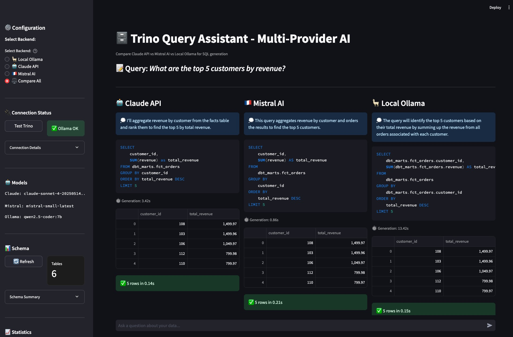

# 🗄️ Trino Query Assistant - Multi-Provider AI Comparison

> **⚠️ macOS :** This project is designed and tested for macOS (Apple Silicon)

A Streamlit application that enables natural language querying of Trino data warehouse using multiple AI providers: **Claude (Anthropic)**, **Mistral AI**, and **Ollama (local)**. Compare how different AI models generate SQL from the same natural language question.

## 🎯 Key Features

- **Multi-Provider AI Comparison**: Side-by-side comparison of Claude, Mistral, and Ollama for SQL generation
- **European AI Sovereignty**: Includes Mistral AI (European) and Ollama (on-premises) options for GDPR compliance
- **Real-time SQL Execution**: Generated SQL queries execute directly against Trino lakehouse
- **Performance Metrics**: Track generation time, execution time, and success rates across providers
- **Schema-Aware**: Automatically loads Trino schema context for accurate SQL generation
- **Query History**: Track and export comparison results



## 🏗️ Architecture

```
┌─────────────────────┐
│   Streamlit UI      │
│  (User Interface)   │
└──────────┬──────────┘
           │
           ├─────────────┬─────────────┬─────────────┐
           │             │             │             │
    ┌──────▼──────┐ ┌───▼────────┐ ┌─▼──────────┐    │
    │   Claude    │ │  Mistral   │ │   Ollama   │    │
    │ (Anthropic) │ │    (EU)    │ │  (Local)   │    │
    │     API     │ │    API     │ │  Qwen 7B   │    │
    └──────┬──────┘ └────┬───────┘ └─┬──────────┘    │
           │             │             │             │
           └─────────────┴─────────────┴─────────────┘
                         │
                  ┌──────▼──────┐
                  │    Trino    │
                  │  Lakehouse  │
                  └─────────────┘
                         │
                  ┌──────▼──────┐
                  │   Polaris   │
                  │   (Iceberg) │
                  └─────────────┘
                         │
                  ┌──────▼──────┐
                  │    MinIO    │
                  │  (Storage)  │
                  └─────────────┘
```

## 🚀 Quick Start

**TL;DR:** You can start completely FREE using Mistral (free tier) + Ollama (local) - no credit card required!

### System Requirements

**Hardware:**
- **macOS** with Apple Silicon (M1/M2/M3) or Intel
- **Minimum 16GB RAM** (24GB recommended for running all components)
- **~10GB free disk space** (for Docker images and models)

**Software:**
- macOS Tahoe or later
- Docker Desktop for Mac 4.0+
- Python 3.11 or later


### Prerequisites

**Required:**
- **Docker Desktop for Mac** - [Download here](https://www.docker.com/products/docker-desktop/)
- **Homebrew** - macOS package manager
  ```bash
  /bin/bash -c "$(curl -fsSL https://raw.githubusercontent.com/Homebrew/install/HEAD/install.sh)"
  ```

**Optional (for local AI):**
- **Ollama** - On-premises AI model runner
  ```bash
  brew install ollama
  ```

**Optional (for cloud AI):**
- **Mistral API key** - [FREE tier available](https://console.mistral.ai) (no credit card)
- **Claude API key** - [Paid account required](https://console.anthropic.com)

### Installation

1. **Clone the repository**
   ```bash
   git clone https://github.com/vincevv017/modern-data-stack.git
   cd modern-data-stack
   ```

2. **Start the data stack**
   ```bash
   # Make sure Docker Desktop for Mac is running first
   docker-compose up -d
   ```

3. **Setup Python environment**
   ```bash
   cd streamlit-app
   
   # Create virtual environment
   python3 -m venv venv
   
   # Activate virtual environment
   source venv/bin/activate
   
   # Install dependencies
   pip install -r requirements.txt
   ```

4. **Install Ollama (for local AI option)**
   ```bash
   # Install via Homebrew
   brew install ollama
   
   # Start Ollama server (in background)
   ollama serve &
   
   # Pull the model
   ollama pull qwen2.5-coder:7b
   
   # Verify installation
   ollama list
   ```

5. **Configure API keys**
   ```bash
   cp .env.example .env
   # Edit .env and add your API keys (optional - see below)
   ```
   
   **Note:** 
   - **Mistral AI** offers a **free tier** (no credit card) - sign up at https://console.mistral.ai
   - **Claude** requires paid API key - sign up at https://console.anthropic.com
   - **Ollama** runs locally - no API key needed

6. **Run the app**
   ```bash
   # Make sure virtual environment is activated
   source venv/bin/activate
   
   # Run Streamlit
   streamlit run app.py
   ```

7. **Access the UI**
   - Open browser to http://localhost:8501
   - Select your preferred AI backend
   - Start querying your data!

## ⚙️ Configuration

### Environment Variables

Create a `.env` file with your configuration:

```bash
# AI Provider API Keys
ANTHROPIC_API_KEY=sk-ant-xxxxx        # Get from https://console.anthropic.com
MISTRAL_API_KEY=xxxxx                  # Get from https://console.mistral.ai

# AI Models
CLAUDE_MODEL=claude-sonnet-4-20250514
MISTRAL_MODEL=mistral-small-latest
OLLAMA_MODEL=qwen2.5-coder:7b

# Trino Configuration
TRINO_HOST=localhost
TRINO_PORT=8080
TRINO_USER=admin
TRINO_CATALOG=lakehouse
TRINO_SCHEMA=dbt_marts

# Ollama Configuration (if running locally)
OLLAMA_HOST=http://localhost:11434
```

### AI Provider Options

| Provider | Privacy | Cost | Speed | Setup |
|----------|---------|------|-------|-------|
| **Claude (Anthropic)** | Cloud API | Pay per token (paid key required) | Fast (~2s) | API key required |
| **Mistral AI** | EU Cloud API | **Free tier available** + pay-as-you-go | Fast (~2s) | Free API key |
| **Ollama (Local)** | On-premises | Free | Slower (~5-10s) | Local installation |

**Getting API Keys:**

- **Mistral AI (FREE)**: Sign up at https://console.mistral.ai - no credit card required for free tier
- **Claude (PAID)**: Sign up at https://console.anthropic.com - requires payment method
- **Ollama**: No API key needed - runs entirely on your machine

**Privacy Comparison:**
- **Claude**: Data sent to US-based API (Anthropic, AWS)
- **Mistral**: Data sent to EU-based API (European data sovereignty)
- **Ollama**: Data stays on your machine (GDPR compliant, fully private)

## 📊 Usage

1. **Open http://localhost:8501** in your browser
2. **Select backend mode** in the sidebar:
   - **🦙 Local Ollama**: 100% local, GDPR-compliant, free
   - **🤖 Claude API**: Cloud-based, fastest, requires paid API key
   - **🇫🇷 Mistral AI**: European cloud, free tier available
   - **⚖️ Compare All**: Side-by-side comparison of all three providers
3. **Ask natural language questions** about your data
4. **View generated SQL**, explanations, and results

**Note:** The app is **stateless** - each query is independent with no conversation history. This ensures clean comparisons and prevents context pollution between queries.

### Example Queries

```
"Show me all tables in dbt_marts"
"Count rows in each table"
"What are the top 5 customers by revenue?"
"Group sales by month for 2024"
"Show first 10 rows from customers"
```

## 📈 Features

### Schema Discovery

- Automatically loads Trino catalog/schema structure
- Shows available tables and columns
- Provides schema context to AI models for accurate SQL generation

### Performance Tracking

The sidebar shows real-time statistics:
- Total queries executed
- Average generation time per provider
- Success rates
- Response time trends

### Query History

- Last 10 queries stored with full comparison data
- Export history as JSON
- Track which provider performed best

### Error Handling

- SQL syntax errors caught and displayed
- API failures handled gracefully
- Connection issues diagnosed with helpful messages

## 🔍 How It Works

1. **User asks a question** in natural language
   - Example: "What are the top 10 customers by total orders?"

2. **App loads schema context** from Trino
   - Fetches table names, column names, data types
   - Formats for AI prompt

3. **AI generates SQL** based on:
   - User question
   - Schema context
   - Trino SQL syntax requirements

4. **SQL executes** against Trino
   - Results displayed as DataFrame
   - Execution time tracked

5. **Comparison shown** (if in Compare All mode)
   - SQL from each provider
   - Timing metrics
   - Result consistency check

## 🛠️ Troubleshooting

### Virtual Environment Issues

```bash
# If venv activation fails on macOS
chmod +x venv/bin/activate
source venv/bin/activate

# Verify venv is activated (should show venv path)
which python

# Deactivate venv
deactivate
```

### Trino Connection Failed

```bash
# Check if containers are running
docker-compose ps

# View Trino logs
docker-compose logs trino -f

# Restart Trino
docker-compose restart trino
```

### Ollama Not Responding

```bash
# Start Ollama server
ollama serve

# Verify model is installed
ollama list

# Pull the model if missing
ollama pull qwen2.5-coder:7b
```

### API Key Errors

- **Claude**: Verify key at https://console.anthropic.com
- **Mistral**: Verify key at https://console.mistral.ai
- Ensure keys are in `.env` file (NOT `.env.example`)
- Restart Streamlit app after updating `.env`

## 📁 Project Structure

```
streamlit-app/
├── app.py                 # Main Streamlit application
├── requirements.txt       # Python dependencies
├── .env.example          # Environment template
└── .env                  # Your actual config (gitignored)
```

## 🔐 Security Notes

- **.env file is gitignored** - Never commit API keys
- **Use .env.example** as template
- **Local Ollama** option keeps data on your machine
- **Mistral AI** provides EU data residency

## 🌍 European AI Sovereignty

This project demonstrates **practical AI sovereignty** by offering:

1. **Mistral AI** - European AI company (Paris-based)
2. **Ollama** - On-premises deployment (data never leaves your infrastructure)
3. **Side-by-side comparison** - Evaluate European alternatives vs US providers

**Why this matters:**
- GDPR compliance requirements
- Data sovereignty regulations
- Reducing dependence on US tech infrastructure
- Supporting European AI ecosystem

## 📊 Performance Benchmarks

Based on typical usage (results may vary):

| Provider | Avg Generation Time | Avg Total Time | Success Rate |
|----------|-------------------|----------------|--------------|
| Claude | 1.5-2.5s | 2-3s | ~95% |
| Mistral | 1.5-2.5s | 2-3s | ~90% |
| Ollama (7B) | 4-10s | 5-11s | ~85% |

**Notes:**
- Ollama is slower but runs entirely on your machine
- Claude/Mistral speeds depend on API latency
- Success rates depend on query complexity

## 🎓 Learning Objectives

This project demonstrates:

- **Modern data stack integration** (Polaris, Trino, dbt)
- **Multi-provider AI orchestration** (Claude, Mistral, Ollama)
- **Real-time SQL generation** from natural language
- **Data sovereignty considerations** for regulated industries
- **Lakehouse architecture** (Iceberg, MinIO)
- **Streamlit application development**

## 🤝 Contributing

This is a personal learning project, but suggestions welcome!

## 📝 License

MIT License - See LICENSE file

## 🔗 Links

- **GitHub**: https://github.com/vincevv017/modern-data-stack
- **Claude API**: https://console.anthropic.com
- **Mistral AI**: https://console.mistral.ai
- **Ollama**: https://ollama.ai
- **Apache Polaris**: https://polaris.apache.org
- **Trino**: https://trino.io

## 📧 Author

**Vincent Vikor**
- Exploring modern data stack and AI-powered analytics

---

**Built with:** Streamlit, Trino, Apache Polaris, MinIO, dbt, Claude, Mistral, Ollama  
**Platform:** macOS (Apple Silicon optimized)